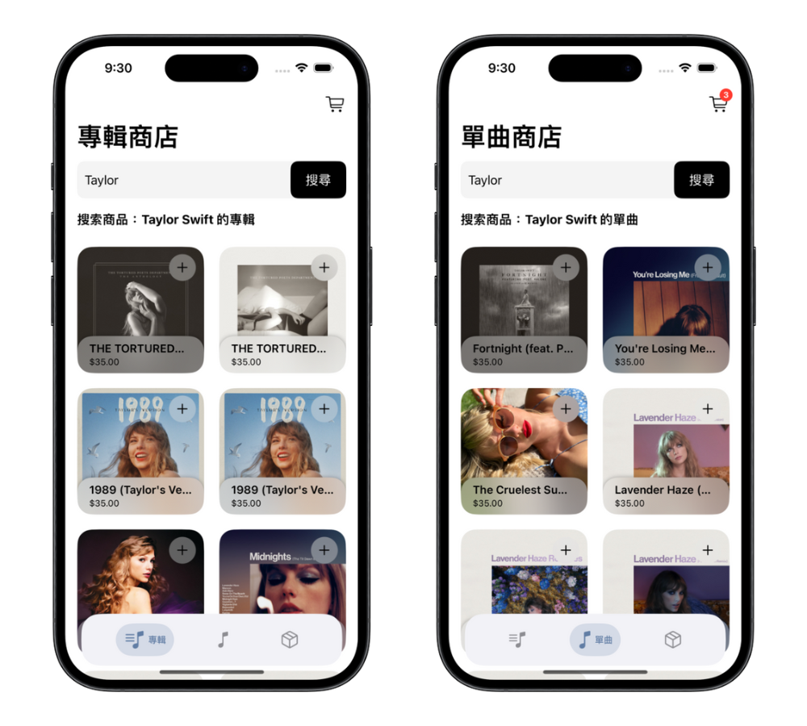
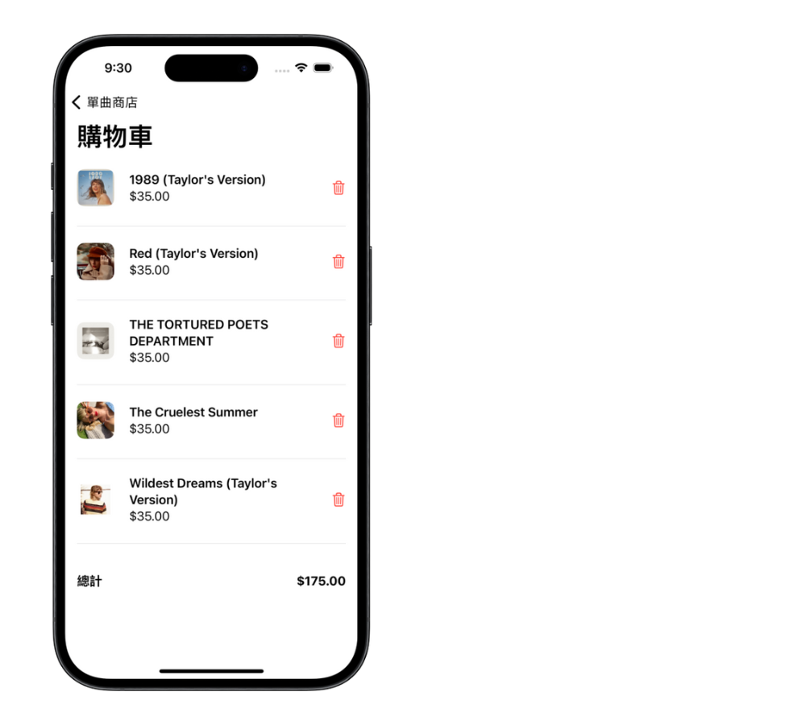

# 音樂購物應用程式 🎵

此專案於 2024 年 5 月製作

「音樂購物應用程式」是一個可以讓使用者瀏覽、購買音樂專輯和單曲的應用程式。此應用程式使用 Spotify API 來取得音樂資訊當作商品，並提供購物車功能，讓使用者方便地將商品加入購物車進行結帳。

注意：此應用僅為學習用途的購物模擬程式，並非商業應用。所有商品價格、庫存等皆為虛構，與實際情況無關，且不提供真實的購買功能。

## 專案展示 🖥

### 專輯與單曲商店

### 商品詳情

### 購物車

## 使用技術 🔧

- **Swift**：進行邏輯撰寫，並使用以下關鍵功能
  - **URLSession**：處理網路請求
  - **@escaping**：標記閉包在函數結束後仍然會被調用，實現異步操作
  - **泛型**：將重複的程式碼封裝成一個函數，減少重複
  - **Codable**：定義 JSON 資料的模型結構
  - **JSONDecoder**：解析 JSON 資料

- **SwiftUI**：構建應用程式界面，並使用以下關鍵功能
  - **ObservableObject**：建立可觀察的物件，監聽屬性變化
  - **@Published**：標記在 ObservableObject 中需要監聽的屬性
  - **@State**、**@StateObject**、**@Binding**、**@EnvironmentObject**：狀態管理和屬性傳遞
  - **LazyVGrid**：構建網格介面
  - **.onDisappear**：控制底部導航列的顯示與隱藏

- **Spotify API**：串接 Spotify API 取得專輯、單曲、歌手等資訊

## 功能 🚀

- **商品瀏覽**：瀏覽不同歌手的音樂專輯和單曲
- **商品詳情**：查看每個商品的詳細資訊，包括價格、庫存和歌手資訊
- **加入購物車**：將商品加入購物車，並統計購物車中的商品價格
- **購物車管理**：查看、移除購物車中的商品，並進行結帳

## 未來功能與改進 ✨

- **優惠券**：提供優惠券頁面查詢，並在結帳時套用於價格
- **隨機庫存與價格**：模擬商品庫存和價格，取代現有的固定資料
- **結帳系統**：模擬購買商品流程，包括填寫地址等資訊
- **商品追蹤**：追蹤商品的出貨和到貨狀態，並提供通知功能
- **類型修正**：由於 Spotify API 會將專輯與單曲都分類為 `Album`，因此需要手動修正顯示的商品類型
- **改進 Spotify API Token 取得方式**：在進入應用程式時自動取得 Token，除了避免過期問題，也取代現有在每次搜尋時皆重新取得 Token 的方式

## 注意事項 📌

製作此專案時，接觸許多新概念，因此註解相較於其他一般專案更為詳細，甚至可能被認為不必要。另外，在程式碼間也添加許多說明，以便日後複習時能夠更容易理解。

## 執行方式 🏃

1. `git clone` 此專案至本機
2. `cd` 進入專案資料夾
3. 打開 Xcode，選擇 `MusicShop.xcodeproj`
4. 點擊 `Run` 按鈕運行應用程式
